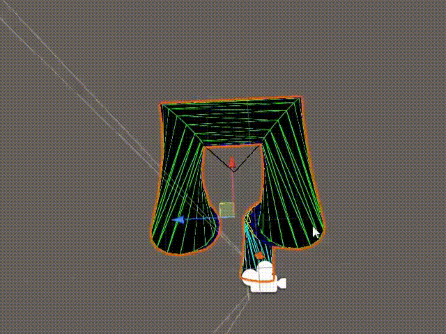

# LineRenderer3D
Adds functionality similiar to Unity's built-in LineRenderer, but with actual 3D geometry


## Performance 
This component was built with performance in mind, thanks to leveraging Job System and Burst compiler it is capable of generating huge amounts of geometry without causing a significant performance impact, generating a line with 2048 points at 16 resolution (65k triangles) takes roughly 1ms in Editor on Ryzen 7 5700X
# Usage
You can add LineRenderer3D script to an empty GameObject and everything will be generated automatically
### Controlling mesh generation
Due to the nature of this component by default `it will not generate any mesh by itself`, there are three options to control its behaviour:
#### Option 1 - Set autoUpdate to true
with this option all meshes will be automatically generated every frame,
you should use this method if your line is dynamically modified
#### Option 2 - Manually generate auto complete
you can manually call function ```BeginGenerationAutoComplete()``` at any time you want, this allows you to make sure that mesh is updated after you set all of the point data,
this function will automatically complete mesh generation in ```LateUpdate()``` to allow for better parallelization, so make sure it's called before ```LateUpdate()```
#### Option 3 - Manually generate
you can manually call function ```BeginGeneration()``` to start mesh generation, this function prepares all the data and schedules mesh generation job, which then has to be completed
using function ```CompleteGeneration()```, if you want to take full advantage of the job system you shouldn't call CompleteGeneration immediately and instead wait until later in the frame,
to allow it to run in parallel to other tasks on the main thread
### Setting points
Outside of manually setting points in Editor, there are following methods for setting point data:
```
AddPoint(Vector3 position, float thickness) - add new point at the end 
```

```
SetPoint(int index, Vector3 position, float thickness) - change point at index
```
```
RemovePoint(int index) - remove point at index
```
```
SetPositions(int positionCount) - change amount of points to positionCount, this will populate the renderer with empty points that you can then modify via SetPoint 
```
```
SetPoints(Vector3[] positions, float thickness) - set points to an array of Vector3 positions, can also take an array of float as thickness
```
For furher reference you can use attached example scripts which showcase different ways of controlling this component
## Installation
Drag this script into Unity Editor and make sure you have Burst Compiler installed, Burst is crucial for perfomance
## Features
Similiar implementations often encounter issues with uneven thickness due to skewing and inconsistent alignment of vertices, this implementation makes sure that all generated meshes remain high quality and automatically fixes all of these issues
### No twisting 

### Consistent thickness 

